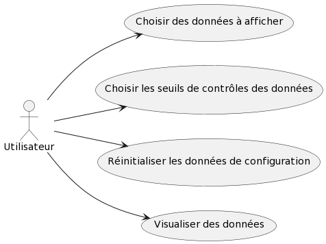

= Documentation technique de l'application IoT
:toc:
:toc-title: Sommaire

Groupe *G2A-7* : Tilian HURÉ, Vincent MIQEU-DENJEAN, Matéo PÉPIN, Hugo WENDJANEH

{empty} +

== I. Présentation de l'application
[.text-justify]
Cette application IoT (Internet of Things) a pour but de contrôler les conditions ambiantes des entrepôts de l'entreprise REVIVE en traitant des données récupérées depuis des capteurs sur un réseau MQTT.

=== 1. Utilisateurs et fonctionnalités globales :
[.text-justify]
Les utilisateurs de l'application (soit les gérants techniques des entrepôts) peuvent accéder aux fonctionnalités décrites dans le Use-Case suivant :

{empty} +

[.text-justify]
Les utilisateurs peuvent à partir de l'interface graphique de l'application, choisir les données à afficher sous forme de diagrammes en bâton (température, humidité, taux de CO2, etc) ; ainsi que les seuils de dépassement des données qui seront affichés en rouge dans les diagrammes lorsque une donnée en dépassera un.

{empty} +

== II. Architecture
=== 1. Architecture générale :
==== 1.1 Scripts et application
[.text-justify]
Tous les fichiers fonctionnels de l'application se trouvent dans le répertoire `Application_IoT/` du dépôt GitHub. L'application est divisée en deux parties :

* Un *script Python* `script.py` qui une fois lancé va se connecter au réseau MQTT des entrepôts, puis tourner en boucle afin de récupérer les données des capteurs et les renseigner au format JSON dans un fichier de données `data.json`. Dans ce dernier ne sont renseignées que les données spécifiées (type de données à récupérer et seuils) dans un fichier de configuration `config.json` utilisé par le script.

Répertoire : `codePython/script.py`

[NOTE]
====
Peu importe le fichier `config.json` donné pour ce script (fichier mal-formé voire absent, etc), ce dernier génerera toujours un fichier de données `data.json` bien formé.
====

* Une *application JavaFX* qui servira d'interface graphique pour les utilisateurs en écrivant le fichier `config.json` à partir des choix de ces derniers et en affichant les données récupérées dans le fichier `data.json` généré par le script Python.

Répertoire : `codeJava/App/`

NOTE: Peu importe le fichier `config.json` donné pour l'application JavaFX (fichier mal-formé voire absent, etc), cette dernière regénerera toujours un fichier de configuration bien formé.

==== 1.2 Fichier de données et de configuration :
[.text-justify]
Comme évoqué précédemment, l'application utilise deux fichiers générés au format JSON :

* Un fichier de configuration `config.json` généré par l'application JavaFX et dans lequel sont reseignées les données à afficher par cette dernière ainsi que leur seuil de dépassement.

Répertoire : `codePython/config.json`

Le fichier JSON par défaut est structuré de la manière suivante :
[source, json]
{
  "donnees": {
    "tvoc": true,
    "activity": true,
    "illumination": true,
    "co2": true,
    "temperature": true,
    "humidity": true,
    "infrared": true,
    "pressure": true
  },
  "seuils": {
    "tvoc": 0.0,
    "activity": 0.0,
    "illumination": 0.0,
    "co2": 0.0,
    "temperature": 0.0,
    "humidity": 0.0,
    "infrared": 0.0,
    "pressure": 0.0
  }
}

* Un fichier de données *data.json* généré par le script Python et dans lequel sont renseignées les données récupérées des capteurs du réseau MQTT en fonction des spécifications du fichier de configuration.

Répertoire : `codePython/data.json`

Le fichier JSON est structuré de la manière suivante (exemple) :
[source, json]
{
    "donnees": {
        "tvoc": 91,
        "activity": 0,
        "illumination": 11,
        "co2": 495,
        "temperature": 20.1,
        "humidity": 33.5,
        "infrared": 4,
        "pressure": 981.8
    },
    "seuils": {
        "tvoc": null,
        "activity": false,
        "illumination": null,
        "co2": null,
        "temperature": false,
        "humidity": false,
        "infrared": true,
        "pressure": true
    }
}

{empty} +

=== 2. Ressources externes :
==== 2.1. Librairies utilisées : [[dependances]]
[.text-justify]
L'application repose sur plusieurs librairies externes nécessaires à son fonctionnement.

*Librairies nécessaires :*

* ``JavaFX`` (version 1.8) : permet le développement d'interfaces homme-machine
* ``json-simple-1.1.jar`` : permet le traitement de données au format JSON

==== 2.2 Exportation de l'application :
[.text-justify]
L'application est disponible à l'exécution sous forme de fichier JAR. Elle peut être régénérée à partir du code source et d'un IDE Java, mais ce dernier devra disposer d'une JRE Java versionnée en 1.8 ainsi que toutes les librairies nécessaires. Les lignes de codes suivantes doivent d'abord être modifiées pour chaque classe :

* `Config.java` ligne 61 :
[source, java]
String path = "config.json";

* `JSONReader.java` ligne 33 :
[source, java]
String path = "data.json";

* `JSONWriter.java` ligne 49 :
[source, java]
String path = "config.json";

{empty} +

=== 3. Structuration de l'application :
==== 3.1 Principe retenu pour la structuration du code :
[.text-justify]
Le code de l'application est structuré en plusieurs packages en suivant (plus ou moins) le MVC (Modèle, Vue, Contrôleur) pattern. Ce dernier est un motif d'architecture logiciel destiné aux interfaces graphiques lancé en 1978 et très populaire pour les applications web. Le motif est composé de trois types de modules ayant trois responsabilités différentes : les modèles, les vues et les contrôleurs.

L'application est structurée en fonction des packages suivants :

* `application` contenant les sous-packages suivant le MVC pattern et la classe ``Main.java`` lançant l'application
* `control` contenant les classes de "dialogue" contrôlant les liaisons entre les classes de traitement de données et les classes gérant l'interface graphique
* `model` contenant les classes de traitement des données (dont des threads)
* `view` contenant les classes "controller" et les vues FXML correspondantes pour l'affichage de l'interface graphique

Aperçu de l'arborescence :

[source]
----
└───application
        ├───control
        ├───model
        └───view
----

{empty} +

=== 4. Éléments essentiels :
==== 4.1 Prérequis pour le développeur :
[.text-justify]
Si le code de l'application devait être repris pour être amélioré ou modifié, le développeur devra avoir au préalable une *JRE version 1.8*. Il faudra ensuite qu'il ait un environnement de développement adapté pour cette version de Java et un Workspace configuré avec *JavaFX* et potentiellement le logiciel *SceneBuilder* pour modifier les fichiers FXML. Les dépendances précisées <<dependances, ici>> devront également être installées.

==== 4.2 Lancement de l'application :
[.text-justify]
L'application peut être lancée de deux manières, via un IDE Java et via le fichier le fichier exécutable `ApplicationIoT.jar`.

===== A) Lancement avec un IDE
[.text-justify]
Pour lancer l'application via un IDE Java, les lignes de codes suivantes doivent d'abord être modifiées pour chaque classe :

* `Config.java` ligne 61 :
[source, java]
String path = System.getProperty("user.dir").replace("codeJava\\App", "codePython\\config.json");

* `JSONReader.java` ligne 33 :
[source, java]
String path = System.getProperty("user.dir").replace("codeJava\\App", "codePython\\data.json");

* `JSONWriter.java` ligne 49 :
[source, java]
String path = System.getProperty("user.dir").replace("codeJava\\App", "codePython\\config.json");

[.text-justify]
La classe `Main.java` doit être la classe `application` à exécuter pour lancer toute l'application correctement.

[.text-justify]
Le script Python doit être lancé *avant* l'application Java, pour cela, les commandes suivantes peuvent être utilisées dans un terminal :

[source, bash]
python codePython/script.py

ou

[source, bash]
python3 codePython/script.py

(essayez l'autre si l'une ne marche pas), en vous plaçant au préalable dans le répertoire `Application_IoT`.

===== B) Lancement via l'exécutable
[.text-justify]
Le poste sur lequel souhaite être lancée l'application avec le fichier JAR exécutable devra préalablement posséder une JRE versionnée en 1.8. Le répertoire `Application_IoT/Application` contient tous les fichiers nécessaires au fonctionnement de l'exécutable.

[.text-justify]
Le script Python `script.py` doit être lancé *avant* l'application. Pour cela, les commandes suivantes peuvent être utilisées dans un terminal :

[source, bash]
python script.py

ou

[source, bash]
python3 script.py

(essayez l'autre si l'une ne marche pas).

[.text-justify]
Le fichier `SETENV.bat` permet de lancer l'application avec le bon encoding et le bon environnement Java qu'il faudra préciser (`clique-droit`, puis "Modifier" sur le fichier BAT).

[NOTE]
====
[.text-justify]
Pour toute information concernant l'installation d'une JRE 1.8, se référer à la *documentation utilisateur*. Et pour plus d'informations à propos du script `script.py`, se référer à la documentation de ce dernier.
====

{empty} +

== III. Descriptions des fonctionnalités techniques
[.text-justify]
L'interface graphique de l'application est divisé en deux partie :

* La partie gauche concernant la configuration des données (données à afficher et seuils)
* La partie droite concernant l'affichage des données récupérées selon la configuration renseignée.

=== 1. Configuration des données
==== 1.1 Chargement/génération d'une configuration
[.text-justify]
Si un fichier de configuration `config.json` existe déjà, l'application met à jour son interface graphique en conséquence, sinon un fichier de configuration par défaut est recréé.

===== A) Packages et classes impliqués

* `model/`
** `Config.java`
** `JSONWriter.java`
* `view/`
** `MainController.java`
** `mainView.fxml`
* `control/`
** `DialogueController.java`

===== B) Éléments essentiels
====== B.1 Fonctions impliquées

* `Config.java`
** `getInstance`
** `loadConfig`
* `JSONWriter.java`
** `getInstance`
** `WriteData`
* `MainController.java`
** `loadView`
* `DialogueController.java`
** `start`
** `loadView`

==== 1.2 Sélection des données à afficher
[.text-justify]
L'utilisateur peut choisir via des cases à côcher quels types de données (température, humidité, etc) il souhaite afficher sur l'interface de l'application. Le fichier `config.json` est mis à jour selon les paramètrages choisis.

===== A) Packages et classes impliqués

* `model/`
** `JSONWriter.java`
* `view/`
** `MainController.java`
* `control/`
** `DialogueController.java`

===== B) Éléments essentiels
====== B.1 Fonctions impliquées

* `JSONWriter.java`
** `getInstance`
** `updateDonnees`
** `writeData`
* `MainController.java`
** `checkBoxListener`
** `loadView`
* `DialogueController.java`
** `checkBoxListener`
** `loadView`

==== 1.3 Choix des seuils de contrôles des données
[.text-justify]
L'utilisateur peut choisir via des 'spinners' les seuils de contrôles des données récupérées. Le fichier `config.json` est mis à jour selon les paramètrages choisis.

===== A) Packages et classes impliqués

* `model/`
** `JSONWriter.java`
* `view/`
** `MainController.java`
* `control/`
** `DialogueController.java`

===== B) Éléments essentiels
====== B.1 Fonctions impliquées

* `JSONWriter.java`
** `getInstance`
** `updateSeuils`
** `writeData`
* `MainController.java`
** `spinnerListener`
** `loadView`
** `getSpinner`
* `DialogueController.java`
** `spinnerListener`
** `loadView`

==== 1.4 Réinitialisation de la configuration
[.text-justify]
L'utilisateur peut réinitialisation les données de configuration par défaut. Le fichier `config.json` est mis à jour en conséquence.

===== A) Packages et classes impliqués

* `model/`
** `JSONWriter.java`
* `view/`
** `MainController.java`
* `control/`
** `DialogueController.java`

===== B) Éléments essentiels
====== B.1 Fonctions impliquées

* `JSONWriter.java`
** `getInstance`
** `writeData`
** `setDonneesByDefault`
** `setSeuilsByDefault`
* `MainController.java`
** `loadView`
** `resetConfig`
* `DialogueController.java`
** `loadView`
** `resetConfig`

{empty} +

=== 2. Affichage des données
==== 2.1 Données et seuils
[.text-justify]
Les données récupérées selon la configuré choisie sont affichées dans l'interface graphique en faisant apparaître en rouge les excès dépassant les seuils fixés pour les données correspondantes.

===== A) Packages et classes impliqués

* `model/`
** `JSONReader.java`
* `view/`
** `MainController.java`
* `control/`
** `DialogueController.java`
** `ShowData.java`

===== B) Éléments essentiels
====== B.1 Fonctions impliquées

* `JSONReader.java`
** `getInstance`
** `sendData`
* `MainController.java`
** `loadView`
* `DialogueController.java`
** `loadView`
* `ShowData.java`
** `getInstance`
** `setData`
** `updateBarCharts`
** `setSeuils`
** `updateSeuil`

{empty} +

[NOTE]
====
Pour plus d'informations à propos des fonctions et des classes impliquées, se référer à la Javadoc du code source de l'application.
====
