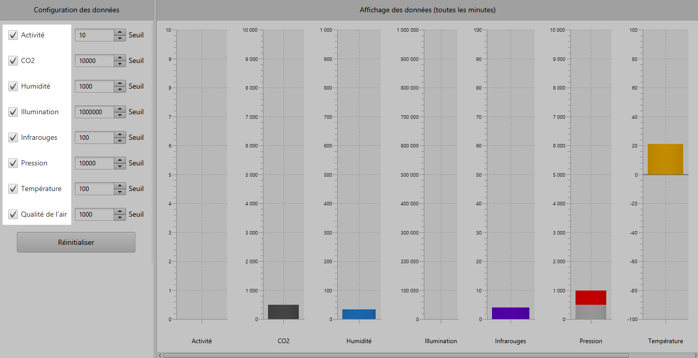
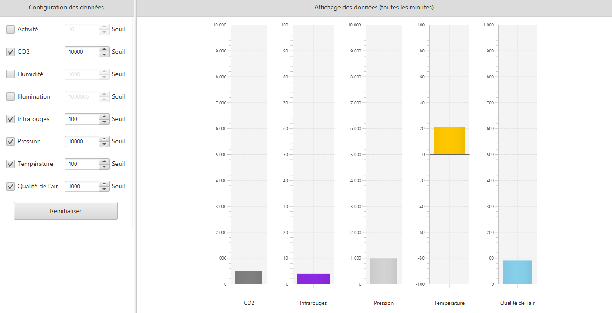
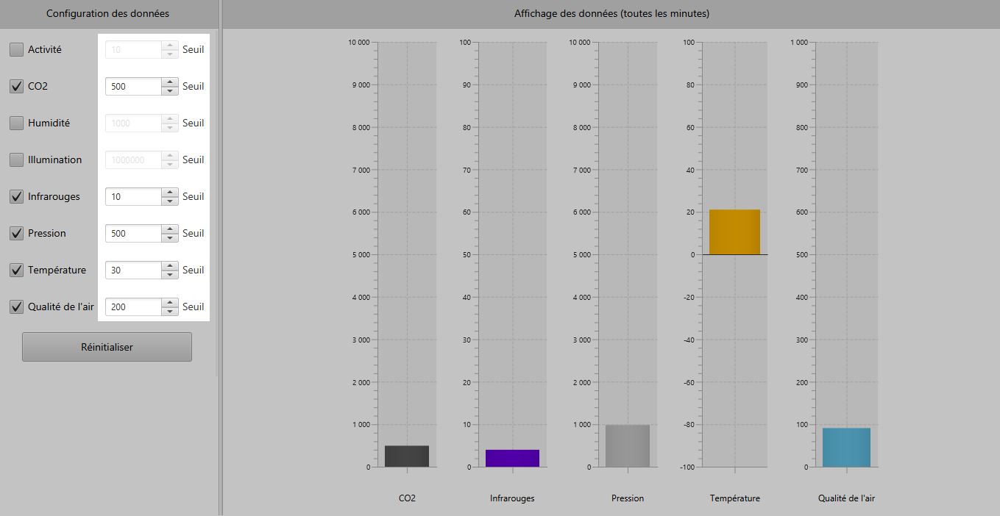
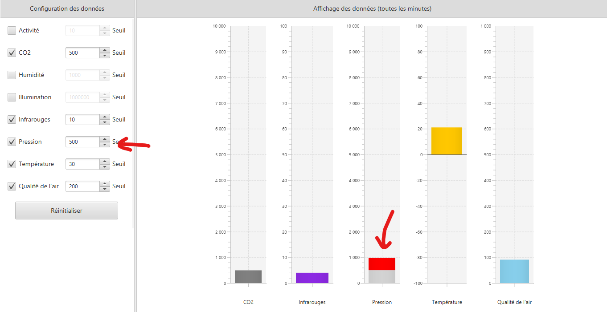
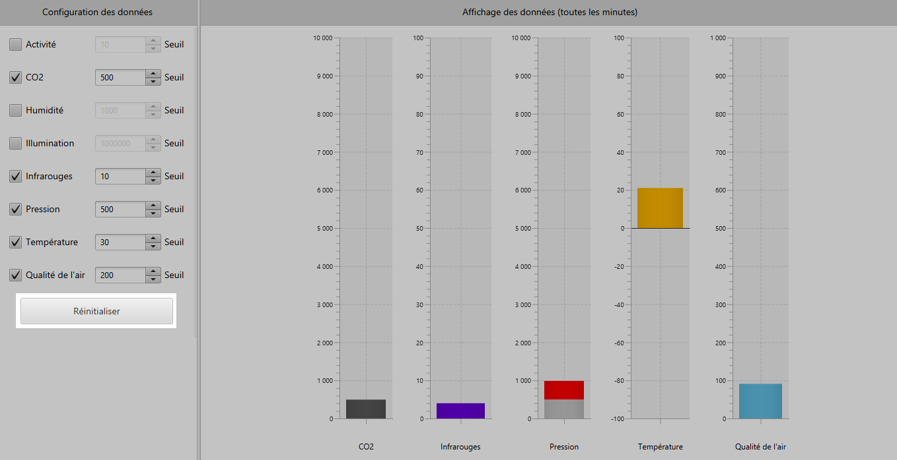
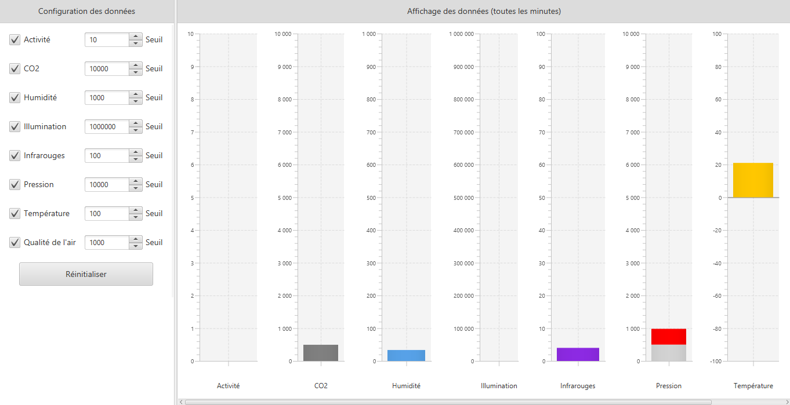

= Documentation utilisateur de l'application IoT
:toc:
:toc-title: Sommaire

Groupe *G2A-7* : Tilian HURÉ, Vincent MIQUEU-DENJEAN, Matéo PÉPIN, Hugo WENDJANEH

{empty} +

== I. Présentation générale et rôle de l'application
[.text-justify]
Cette application IoT (Internet of Things) a pour but de contrôler les conditions ambiantes des entrepôts de l'entreprise REVIVE en traitant des données récupérées depuis des capteurs sur un réseau MQTT.

[.text-justify]
Les utilisateurs peuvent à partir de l'interface graphique de l'application, choisir les données à afficher sous forme de diagrammes en bâton (température, humidité, taux de CO2, etc) ; ainsi que les seuils de dépassement des données qui seront affichés en rouge dans les diagrammes lorsqu'une donnée en dépassera un.

{empty} +

== II. Installation et utilisation
=== 1. Installation et prérequis
[.text-justify]
Concernant l'installation de l'application et son utilisation, l'utilisateur aura besoin de certains prérequis.

[.text-justify]
Il sera d'abord indispensable de disposer d'un environnement d'exécution *Java en version 8* (JRE 1.8) sous le système d'exploitation *Linux*. Ce dernier devra être installé et configuré dans le terminal, par exemple avec *JENV* sur Mac et Linux, ou une alternative sur Windows. L'utilisateur devra aussi disposer de la dernière version de *Python3*.

Références :

* https://www.java.com/fr/download/manual.jsp[Installer Java 8]
* https://www.jenv.be/[Configurer l'environnement Java avec JENV]
* https://www.python.org/downloads/[Installer Python 3]

{empty} +

=== 2. Lancement de l'application
[.text-justify]
Le lancement de l'application se fait avec le fichier exécutable `RUNAPP.sh` du répertoire `Application` contenant tous les fichiers nécessaires à l'exécution de l'application. Ce fichier doit être configuré (modifié) en renseignant le chemin de la JRE 1.8 du poste dans la ligne 2 :

[source, bash]
JDK8="chemin_jre_1.8"

[.text-justify]
Une fois configuré et exécuté, ce fichier permet de lancer correctement le script Python `script.py` puis l'application Java étant le fichier `ApplicationIoT.jar`.

{empty} +

== III. Fonctionnement de l'application
=== 1. Choix des données à afficher
[.text-justify]
L'utilisateur peut choisir les données qu'il souhaite afficher dans l'application via des cases à côcher. Pour cela, côcher ou dé-côcher les cases à côcher correspondant aux données à afficher dans la partie "Configuration des données" (partie de gauche) de l'interface graphique.

{empty} +

[.text-justify]
En ce faisant, les données devraient apparaître ou non sous forme de diagrammes en bâton dans la partie "Affichage des données" (partie de droite) de l'interface graphique.

{empty} +

=== 2. Saisie des seuils de contrôle
[.text-justify]
L'utilisateur peut saisir les seuils de contrôles des données affichées. Pour cela, saisir des valeurs numériques dans les champs "Seuil" correspondant aux données à afficher dans la partie "Configuration des données" (partie de gauche) de l'interface graphique.

{empty} +

[.text-justify]
En ce faisant, les diagrammes en bâton affichés dont la donnée dépasse le seuil fixé affichera en rouge l'excès correspondant, dans la partie "Affichage des données" (partie de droite) de l'interface graphique.

{empty} +

=== 3. Réinitialisation des données de configuration
[.text-justify]
L'utilisateur peut réinitialiser les données de configuration de l'application en cliquer sur le bouton "Réinitialiser" dans la partie "Configuration des données" (partie de gauche) de l'interface graphique.

{empty} +

[.text-justify]
En ce faisant, tous les diagrammes en bâton seront ré-affichés et les seuils de contrôles des données seront réglés avec les valeurs maximales des données correspondantes.

{empty} +

=== 4. Fermeture de l'application
[.text-justify]
Il est recommandé de fermer l'application "normalement" en utilisant l'option correspondante de votre système d'exploitation (souvent une croix en haut à droite de la fenêtre, ou la commande `ALT+F4`, ou `Clique-droit` puis "Fermer" sur la fenêtre, etc), afin d'assurer une fermeture compléte. Si le fichier `config.json` généré par l'application (dans le répertoire `codePython`) est laissé intact, vous pourrez ré-ouvrir l'application en récupérant votre dernière configuration.

{empty} +