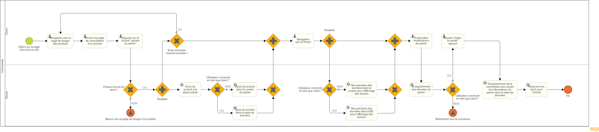

= Analyse d'impact
:toc: auto
:toc-title: Sommaire
:toclevels: 4
:title-separator: any
:nofooter:

toc::[]

== Vue d'ensemble des traitements réalisés

=== Description des traitements de données
* Enregistrement des informations de compte utilisateur lors de la création d'un compte sur le site :
** Nom
** Prénom
** Adresse e-mail
** Mot de passe
** Adresse postale

* Stockage des informations de commande pour la gestion des commandes :
** Prix de la commande
** Date de la commande
** Les produits commandés
** La quantité de chaque produit commandé
** Le descriptif de chaque produit commandé ( exemple: taille, couleur, etc. )

* Utilisation des informations de compte utilisateur pour personnaliser les offres et les recommandations de produits pour chaque utilisateur par rapport à l'acceptation des annonces lors de la création du compte.

=== Finalités des traitements de données

* Permettre aux utilisateurs de créer un compte sur le site pour acheter des produits.

* Gérer les commandes et assurer la livraison des produits achetés.

* Améliorer l'expérience utilisateur en personnalisant les offres et les recommandations de produits.

=== Enjeux liés à la protection des données

* Respect des réglementations en matière de protection des données, en particulier le Règlement général sur la protection des données (RGPD).

* Sécurité des informations de compte utilisateur et pour éviter les fraudes.

* Garantir la confidentialité des informations de commande pour protéger la vie privée des utilisateurs.

=== Mesures de sécurité mises en place

* Mise en place d'une politique de mot de passe fort pour protéger les comptes utilisateurs.

* Cryptage des données sensibles (mot de passe) pour assurer la confidentialité des données.

* Mise en place d'un système de protection contre les attaques par injection SQL pour éviter les tentatives de piratage.

Ce document d'analyse d'impact de protection des données permet de prendre en compte les enjeux liés à la protection des données pour garantir la conformité avec les réglementations en vigueur, et de mettre en place les mesures nécessaires pour assurer la sécurité des données.

== Description des processus, des données et supports

=== Processus

* Enregistrement des informations de compte utilisateur : lorsque les utilisateurs créent un compte sur le site, ils doivent fournir des informations telles que leur nom, prenom, e-mail, mot de passe. Ces informations sont stockées dans une base de données sécurisée. Et le mot depasse est crypté.

* Gestion des commandes : lorsqu'une commande est passée, les informations de commande (prix, date, produits commandés, quantité, descriptif) sont stockées dans une base de données sécurisée et utilisées pour gérer les commandes et assurer la livraison des produits achetés.

* Personnalisation des offres : les informations de compte utilisateur sont utilisées pour personnaliser les offres et les recommandations de produits pour chaque utilisateur.

=== Données

* Informations de compte utilisateur : 
** nom
** prénom
** adresse e-mail
** mot de passe
** adresse postale
** date de création du compte
** acceptation des annonces

* Informations de commande : 
** prix de la commande
** date de la commande
** produits commandés
** quantité de chaque produit commandé
** descriptif de chaque produit commandé

* Informations de profil utilisateur :
** historique d'achat
** préférences d'achat

=== Supports

* Base de données : les informations de compte utilisateur et les informations de commande sont stockées dans une base de données sécurisée pour assurer la sécurité des données.

* Serveur web : le site est hébergé sur un serveur web sécurisé pour protéger les informations stockées sur le site.

Ce document décrit les processus de traitement des données pour le site de e-commerce, les types de données qui sont collectées et traitées et les supports utilisés pour stocker et traiter les données. Ces informations permettent de comprendre comment les données sont traitées et gérées pour garantir la sécurité et la conformité avec les réglementations en vigueur.

== Récapitulatif des risques et conséquences en matière de cyber sécurité de ces données

|=========================================================================================================
| *Risque* | *Principales menaces* | *Principaux impacts* | *Mesures pour réduire ce risque* | *Niveau de gravité*
| Piratage de compte utilisateur | Tentatives d'accès non autorisé à des comptes utilisateur | Vol d'informations personnelles | Mise en place d'une politique de mot de passe fort | Élevé
| Injection SQL | Injection de commandes malveillantes dans les formulaires de saisie de données | Fuite de données sensibles, perturbation des opérations du site, connexion à un compte utilisateur/Administrateur | Utilisation de requêtes préparées pour éviter les injections SQL | Élevé
| Attaque par déni de service | Envoi de requêtes massives pour surcharger le site et le rendre inaccessible | Interruption de service pour les utilisateurs, perte de revenus, perte de données, interruption de service administratif | Mise en place de mesures de défense contre les attaques par déni de service, limitation des requêtes par IP | Élevé
| Phishing | Utilisation d'e-mails ou de sites frauduleux ressemblant à REVIVE pour voler des informations de compte utilisateur | Vol d'informations personnelles | Sensibilisation des utilisateurs aux risques de phishing, vérification de l'identité de l'expéditeur des e-mails, vérification de l'URL du site | Moyen
| Stockage des données | Perte ou vol des supports de stockage des données/données  | Fuite de données sensibles, perturbation des opérations du site | cryptage des données sensibles, mise en place de procédures de récupération de données en cas de sinistre | Faible
|=========================================================================================================

Ce tableau permet de récapituler les risques les plus importants en matière de cybersécurité le site REVIVE, les menaces qui y sont associées, les impacts potentiels sur le site et les utilisateurs ainsi que les mesures qui peuvent être mises en place pour réduire ces risques. Il permet également de classer les risques selon leur niveau de gravité, ce qui permet de prioriser les mesures de sécurité à mettre en place.

== Mesures applicables et leurs modalités de mise en œuvre concernant la protection des données

=== Cryptage des données sensibles

Les information de mot de passe sont cryptées avant d'être stockées dans la base de données pour éviter les tentatives de piratage.

=== Authentification forte

Les utilisateurs doivent fournir des informations d'authentification fortes (nom d'utilisateur et mot de passe) pour accéder à leur compte utilisateur.

=== Contrôle d'accès

L'accès aux données est limité aux utilisateurs qui ont besoin de ces données pour effectuer leur travail.
L'accès aux actions/données est limité aux administrateurs qui ont besoin de ces actions/données pour effectuer leur travail.

=== Règlement général sur la protection des données (RGPD)

Respect des obligations du RGPD en matière de protection des données.

|=========================================================================================================
| *Mesure* | *Modalités de mise en œuvre* | *Priorité*
| Cryptage des données sensibles | Utilisation d'algorithmes de cryptage standard tels que "bcrypt" pour crypter les données, stockage des clés de cryptage dans un lieu sécurisé, vérification de la validité des certificats de sécurité lors de la transmission des données cryptées. | Élevé
| Authentification forte | M    ise en place d'une politique de mot de passe fort (longueur minimale, caractères spéciaux, etc.). | Élevé
| Contrôle d'accés | Mise en place de rôles et de droits d'accès pour les utilisateurs et les administrateur, utilisation de mécanismes d'authentification pour vérifier l'identité des utilisateurs/administrateurs. | Élevé
| Règlement général sur la protection des données (RGPD) | Mise en place d'un registre des activités de traitement, mise en place de procédures de notification des fuites de données, mise en place de procédures de gestion des demandes d'accès (dans le cadre des utilisateurs administrateurs) et de rectification. | Élevé
|=========================================================================================================

Cette liste de mesures permet de protéger les données sensibles et les informations personnelles des utilisateurs contre les risques de sécurité. Il est important de noter que ces mesures ne sont pas exhaustives et qu'il est nécessaire de les adapter et de les mettre à jour régulièrement en fonction des évolutions des risques et des technologies disponibles. Il est également important de noter que ces mesures ne suffisent pas à garantir la sécurité des données à elles seules, il est nécessaire de les combiner avec une culture de sécurité et de sensibilisation des utilisateurs pour garantir un niveau de sécurité optimal.

== Mesures applicables et leurs modalités de mise en œuvre concernant la sécurité des données

=== Mise à jour de sécurité 
Les logiciels et les systèmes utilisés sur le site sont mis à jour régulièrement pour corriger les vulnérabilités de sécurité.

=== Pare-feu
Un pare-feu est utilisé pour protéger le site contre les attaques extérieures.

=== Détection d'intrusion
Un système de détection d'intrusion est utilisé pour détecter les tentatives d'accès non autorisé ou les comportements anormaux sur le site.

=== Contrôle d'accès physique
Les locaux où les données sont stockées et traitées sont protégés contre les accès non autorisés.

=== Sauvegarde des données
Les données sont sauvegardées régulièrement pour assurer la disponibilité des informations en cas de sinistre.

|=========================================================================================================
| *Mesure* | *Modalités de mise en œuvre* | *Priorité*
| Mise à jour de sécurité | Utilisation d'un système automatisé de mise à jour pour les logiciels et les systèmes, vérification régulière des mises à jour de sécurité pour les logiciels et les systèmes qui ne peuvent pas être mis à jour automatiquement, application des mises à jour de sécurité dès qu'elles sont disponibles. | Élevé
| Pare-feu | Configuration du pare-feu pour bloquer les ports non utilisés, utilisation de règles de filtrage pour limiter l'accès au site aux adresses IP autorisées, journalisation des tentatives de connexion pour détecter les tentatives d'attaque. | Moyen
| Détection d'intrusion | Installation d'un système de détection d'intrusion sur les serveurs et les réseaux, configuration des règles de détection pour identifier les comportements anormaux, analyse régulière des journaux de sécurité pour détecter les intrusions ou les tentatives d'intrusion. | Élevé
| Contrôle d'accès physique | Installation de serrures et de systèmes d'alarme sur les locaux, utilisation de badges d'accès pour les employés, surveillance vidéo des locaux, mise en place de procédures pour gérer les accès temporaires (p. ex. visiteurs, prestataires). | Élevé
| Sauvegarde des données | Sauvegarde des données sur des supports externes (disques durs, bandes, nuages), planification des sauvegardes en fonction de la fréquence d'utilisation des données, vérification régulière de la validité des sauvegardes. | Faible
|=========================================================================================================

== Issues à ajouter au dernier sprint pour tenir compte des points 4 et 5 les plus importants

=== Mise en place d'un système de sauvegarde des données 
Cette issue pourrait inclure la mise en place d'un système de sauvegarde des données pour assurer la disponibilité des informations en cas de sinistre.

=== Mise en place des règles de conformité RGPD
Cette issue pourrait inclure la mise en place d'un registre des activités de traitement, la mise en place de procédures de notification des fuites de données, la mise en place de procédures de gestion des demandes d'accès, de rectification et d'effacement des données.

=== Mise en place d'un système d'authentification forte
Cette issue pourrait inclure la mise en place d'une politique de mot de passe fort (longueur minimale, caractères spéciaux, etc.), ainsi qu'une vérification de l'email de l'utilisateur lors de la création de son compte. *(déjà mis en place ✔️)*
