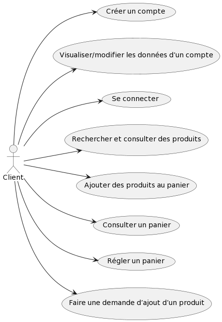
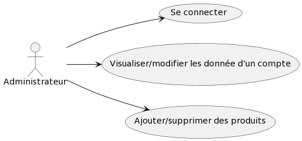
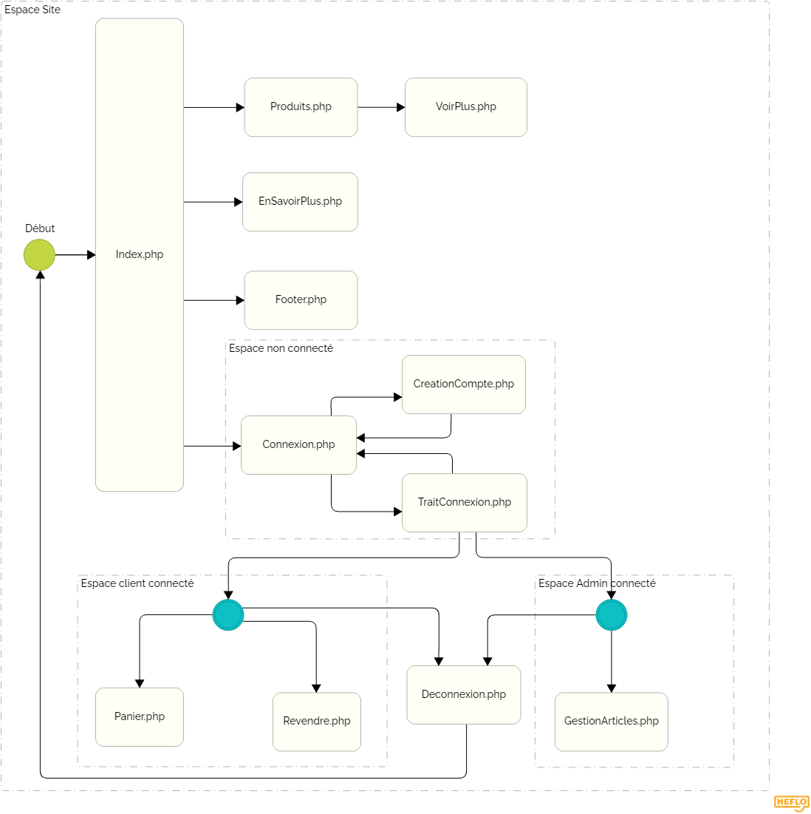
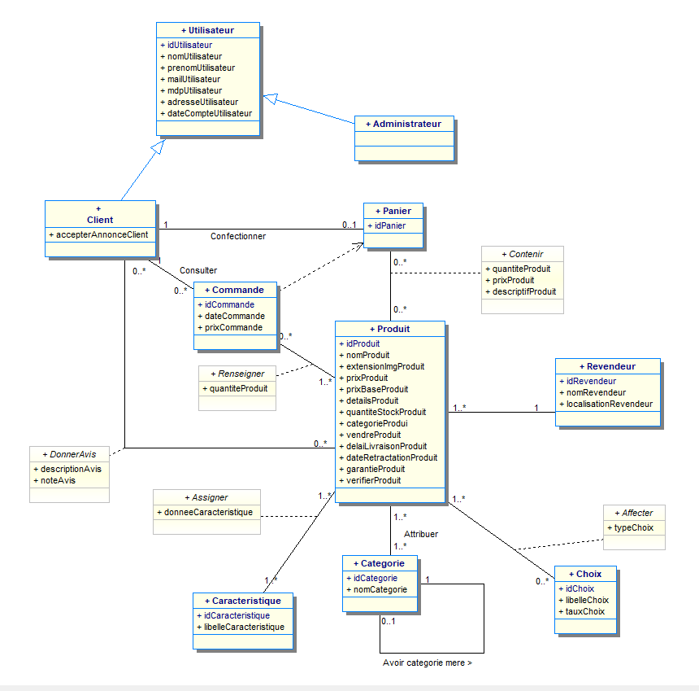

= Documentation technique du site web REVIVE
:toc:
:toc-title: Sommaire

== I. Présentation du site web
[.text-justify]
Le site web REVIVE est un site d'e-commerce ayant été demandé par l'entreprise du même nom dont le but de vendre en ligne ses produits reconditionnés.

=== 1. Les utilisateurs :
[.text-justify]
Le site web peut être utilisé par n'importe qu'elle type d'utilisateur non-connecté. Cependant il existe deux types d'utilisateurs pouvant être connecté pour accéder à certaines fonctionnalités : les clients et les administrateurs.

Use-Cases :

{empty} +

{empty} +

[.text-justify]
Les *clients* sont les principaux types d'utilisateurs, ils peuvent :

* Créer un compte client
* Consulter et modifier les informations de leur compte
* Se connecter en tant que client
* Rechercher et consulter des produits
* Ajouter des produits au panier
* Consulter leur panier
* Régler leur panier
* Faire une demande d'ajout d'un produit

[.text-justify]
Les *administrateurs* ont accès à des fonctionnalités similaires aux client et à des fonctionnalités supplémentaires concernant la gestion du site, ils peuvent :

* Consulter et modifier les informations de leur compte
* Se connecter en tant qu'administrateur
* Ajouter/Supprimer des produits
* Ajouter/Supprimer des catégories de produits

{empty} +

== II. Architecture

=== 1. Structure du site :

Diagramme SEP :

{empty} +

[.text-justify]
Le site web est structurés en plusieurs répertoires :

* `include` contenant les fichiers PHP nécessaires au fonctionnement des pages du site (header, footer, etc)
* `pages` contentant toutes les pages PHP principales du site
* `public` contentant les fichiers externes utilisés sur le site (fichiers CSS, images, fichiers JavaScript, etc)

Aperçu :

[source]
----
├───include
├───pages
└───public
    ├───css
    ├───images
    │   └───produits
    └───js
----

=== 2. Base de données du site :

Diagramme de classes de la base de données :

{empty} +

[.text-justify]
Toutes les données manipulées par le site sont stockées dans une base de données Oracle SQL externes. +
Elles sont structurées de la manière suivante :

* Un *Client* confectionne un seul _panier_ et peut consulter 0 ou plusieurs _commandes_ enregistrées
* Les _administrateurs_ sont stockés dans la base de données mais ils sont représentés par une table indépendante
* Un *Produit* est attribué à une catégorie, est affecté à 1 ou plusieurs _choix_ (couleur du produit, capacité, etc) et est assigné à une ou plusieures _caractéristiques_ (taille, poid, etc)
* Une *Categorie* peut avoir ou non une _catégorie mère_
* Un *Panier* peut contenir 0 ou plusieurs _produits_
* Une *Commande* peut renseigner 1 ou plusieurs produits

=== 3. Ressources externes :
==== 3.1. Librairie(s) utilisée(s) :
[.text-justify]
Pour toutes les fonctionnalités y compris la connexion concernant la base de données, le site web utilise la librairie https://www.php.net/manual/fr/book.oci8.php[Oci8].

=== 4. Éléments essentiels :
==== 4.1 Prérequis pour les développeurs :
[.text-justify]
Si le code du site devait être repris pour être amélioré ou modifié, le développeur devra avoir au préalable un outil lui permettant de développer avec *HTML5*, *CSS*, *JavaScript* et *PHP8*.

[.text-justify]
Le site utilise une *base de données Oracle-SQL* dont le script SQL-LDD de création est fourni avec le code source du site. Cette base de données fonctionne avec des procédures déclarées dans un paquetage `Gestion_REVIVE` et des déclencheurs dont les PL/SQL scripts sont également fournis. Un script SQL-LMD est également fourni dans le but de remplir la base de données avec un jeu de données réel.

[.text-justify]
Le fichier `connect.inc.php` du répertoire `include` peut être modifié afin de contenir les données de connexion à une nouvelle base de données.

{empty} +

== III. Fonctions et Fichiers inclus dans les pages du site

=== 1. Pages du panier
==== 1.1 Fichier include/panier.php
[.text-justify]
Ce fichier sert à gérer toute la partie technique du panier, tel que les échanges avec la base de données, les calculs, la gestion de la connexion et des cookies en cas de non connexion. +

Fonctions utilisées :

    -getProduits()
    -setIdClient()
    -enleverProduit()
    -changeQuantiteProduit()
    -prixTotalProduits()
   
==== 1.2 Page panier.php
[.text-justify]
Ce fichier permet l'affichage du panier et des différents produits contenus à l'intérieur de celui-ci. +

Fichiers inclus :

    -heckConnexion.php
    -infoPopup.php
    -style.css
    -header.php
    -panier.css
    -consultProduit.php
    -changerQuantiteProduitPanier.php
    
==== 1.3 Fichier include/changerQuantiteProduit.php
[.text-justify]
Ce fichier sert à gérer l'affichage dynamique du prix en fonction du changement de la quantité d'un produit dans le panier. +

Fonctions utilisées :

    -changeQuantiteProduit()
    
Fichiers inclus :

    -include/panier.php
    -checkConnexion.php
    -pages/panier.php
    
==== 1.4 Fichier include/supprimerProduitPanier.php
[.text-justify]
Ce fichier sert à gérer l'affichage dynamique du prix lorsqu'on supprime un produit du panier et donne également un signal à include/panier.php que le produit a été supprimé du panier, pour que ce dernier puisse faire la mise à jour dans la BD. +

Fonctions utilisées :

    -enleverProduit()
    
Fichiers inclus :

    -include/panier.php
    -checkConnexion.php
    -pages/panier.php

==== 1.5 Fichier include/validerCommande.php
[.text-justify]
Ce fichier permet de créer une commande lors de la validation de l'achat dans le panier, le panier est ensuite vidé. +

Fonctions utilisées :

    -validerCommande()
    
Fichiers inclus :

    -include/panier.php
    -checkConnexion.php
    -pages/panier.php

=== 2. Pages de consultation et affichage de produits
==== 2.1 Page consultProduit.php
[.text-justify]
Cette page permet de consulter les informations d'un produit et de l'ajouter dans son panier en choisissant différentes options et la quantité de ce produit qu'on veut acheter, on peut en suite cliquer sur le bouton "ajouter au panier" qui redirige vers la page "ajouterProduitPanier.php". On peut également voir la liste des avis donnés sur le produit. Lorsque l'utilisateur est connecté, un bouton permettant d'accéder à la page formulaireAjoutAvis.php est présent. +

Fichiers inclus : 

    -checkConnexion.php
    -index.php
    -style.css
    -header.php
    -footer.php
    -consultStyle.css
    -avisClientTri.js
    -prixProduit.js
    -infoPopup.php
    -formulaireAjoutAvis.php
    
==== 2.2 Page formulaireAjoutAvis.php 
[.text-justify]
Ce fichier permet à l'utilisateur d'ajouter un avis concernant un produit, lorsqu'il a validé le formulaire, son avis est enregisté dans la base de données et il est renvoyé vers la page de consultation du produit. +

Fichiers inclus :

    -connexionStyle.css
    
==== 2.3 Fichier include/ajouterProduitPanier.php
[.text-justify]
Ce fichier permet d'ajouter un produit dans le panier et de donner toutes les informations nécessaires pour son bon affichage, il redirige ensuite vers la page de consultation du produit. +

Fonctions utilisées :

    -ajouterProduit()
    
Fichiers inclus :

    -panier.php"
    -checkConnexion.php
    -consultProduit.php
    
==== 2.4 Page listerProduits.php
[.text-justify]
Cette page permet d'afficher la liste des produits de la BD, triés par catégorie en utilisant le menu déroulant du header ou par nom/description en utilisant la barre de recherche. Lorsqu'on clique sur un produit on accède à la page de consultation de ce dernier. +

Fichiers inclus :

    -style.css
    -header.php
    -footer.php
    -listProduit.css
    -checkConnexion.php
    
=== 3. Pages de connexion, gestion de compte
==== 3.1 connexion.php
[.text-justify]
Cette page permet à un utilisateur de se connecter à son compte, lorsque c'est fait il est redirigé vers l'accueil et une variable de session est créée. Un lien en bas de la page permet d'accéder à la page creationCompte.php si l'utilisateur n'a encore jamais créé de compte. +

Fonctions utilisées :

    -get_utilisateur_from_mail()
    -connecter_client()
    
Fichiers inclus :

    -checkConnexion.php
    -infoPopup.php
    -style.css
    -header.php
    -footer.php
    -connexionStyle.css
    
==== 3.2 page creationCompte.php
[.text-justify]
Ce fichier permet à un utlisateur de créer un compte client, il redirige vers la page connexion.php lorsque le compte est créé. +

Fichiers inclus :

    -infoPopup.php
    -checkConnexion.php
    -connexionStyle.css
    
==== 3.3 page consultCompte.php
[.text-justify]
Ce fichier permet à un client ou un administrateur de consulter les informations sur son compte, il y a un bouton amenant vers la page modifierCompte.php et un bouton permettant de le déconnecter de son compte. +

Fonctions utilisées :

    -verifier_page()
    
Fichiers inclus :

    -infoPopup.php
    -checkConnexion.php
    -connexionStyle.css

==== 3.4 Page modifierCompte.php
[.text-justify]
Ce fichier permet à un client ou un administrateur de modifier les informations de son comptes, et son mot de passe. Lorsque le bouton "Valider" est cliqué, la page redirige vers consultCompte.php. +

Fonctions utilisées :

    -verifier_page()
    
Fichiers inclus :

    -infoPopup.php
    -checkConnexion.php
    -connexionStyle.css
    
=== 4. Pages d'administrateur
==== 4.1 Page ajouterProduit.php
[.text-justify]
Cette page permet pour un administrateur d'ajouter un produit dans la base de données, un pop-up apparaît en fonction du succès ou de l'échec de l'ajout. +

Fonctions utilisées :

    -verifier_page()
    
Fichiers inclus :
    
    -checkConnexion.php
    -infoPopup.php
    -connexionStyle.css
    
==== 4.2 Page supprimerProduit.php
[.text-justify]
Cette page permet pour un administrateur de supprimer un produit de la base de données, il n'est pas vraiment supprimé mais plutôt désactivé. +

Fonctions utilisées :

    -verifier_page()
    
Fichiers inclus :
    
    -checkConnexion.php
    -infoPopup.php
    -connexionStyle.css
    
==== 4.3 Page ajouterCategorie.php
[.text-justify]
Cette page permet pour un administrateur d'ajouter une catégorie dans la base de données, un pop-up apparaît en fonction du succès ou de l'échec de l'ajout. +

Fonctions utilisées :

    -verifier_page()
    
Fichiers inclus :
    
    -checkConnexion.php
    -infoPopup.php
    -connexionStyle.css
    
==== 4.4 Page supprimerCategorie.php
[.text-justify]
Cette page permet pour un administrateur de supprimer une catégorie de la base de données, cela fonctionne uniquement si elle n'a pas de catégorie fille et si tous les produits l'ayant pour catégorie sont désactivés. +

Fonctions utilisées :

    -verifier_page()
    
Fichiers inclus :
    
    -checkConnexion.php
    -infoPopup.php
    -connexionStyle.css
    
=== 5. Pages supplémentaires avec affichage
==== 5.1 Page index.php
[.text-justify]
Cette page est l'accueil du site, elle donne une courte description de l'entreprise et un bouton qui mène vers la page aProps.html. +

Fichiers inclus :

    -index.css
    
==== 5.2 fichier include/header.php
[.text-justify]
Ce fichier sert à gérer l'affichage du header dans toutes les pages du site. Le header permet d'accéder à la page d'accueil en cliquant sur le logo. Il y a 3 boutons au milieu permetttant d'accéder respectivement à la page aPropos.html, connexion.php (ou consultCompte si l'utilsateur est connecté) et panier.php. À gauche, un menu déroulant affichant les catégorie permet d'accéder à la page listerProduit.php en triant par catégorie. Lorsqu'un utilisateur est connecté en tant qu'administrateur il a un autre menu déroulant à droite du précédent permettant d'accéder à toutes les pages administrateur de CRUD du site. Enfin, une barre de recherche à droite du header permet d'accéder encore une fois à la page listerProduit.php mais en triant par nom/description cette fois-ci. +

Fonctions utilisées :

    -afficher_categories()
    
Fichiers inclus :

    -checkConnexion.php
    -listerProduits.php
    -panier.php
    -consultCompte.php
    -connexion.php
    -aPropos.html
    -index.php
    
==== 5.3 Fichier include/footer.php
[.text-justify]
Ce fichier permet l'affichage du footer dans toutes les pages, il contient des liens menant vers la page aPropos.html. +

Fichiers inclus : 

  -aPropos.php
  
==== 5.4 Page aPropos.php
[.text-justify]
Cette page affiche des informations à propos du site (feur). +

Aucun appel de fonction ou de lien à un fichier

=== 6. Pages supplémentaires fonctionnelles

==== 6.1 Fichier include/checkConnexion.php
[.text-justify]
Ce fichier permet de vérifier si la connexion au site est bien sécurisée, de gérer la session, gérer la connexion d'un client ou d'un administrateur. Il utilise connect.inc.php. +

Fonctions utilisées :

    -get_utilisateur_from_mail()
    -connecter_client()
    -connecter_admin()
    -verifier_page()

Fichiers inclus :

    -connect.inc.php

==== 6.2 Fichier include/connect.inc.php
[.text-justify]
Ce fichier permet de vérifier la connexion du site à la base de données. +

Aucun appel de fonction ou de lien à un fichier

==== 6.3 Fichier include/infoPopup.php
[.text-justify]
Ce fichier permet de gérer les pop-ups dans les différentes pages du site. +

Fonctions utilisées :

    -close_info_popup()
    -show_info_popup()

