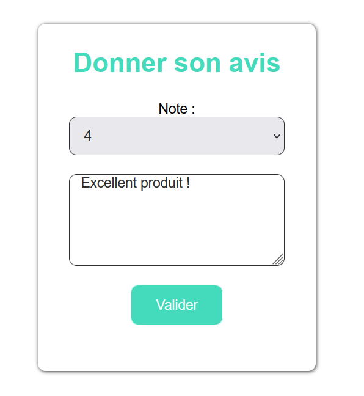

= Documentation utilisateur du site web REVIVE
:toc:
:toc-title: Sommaire

Groupe *G2A-7* : Tilian HURÉ, Vincent MIQEU-DENJEAN, Matéo PÉPIN, Hugo WENDJANEH

{empty} +

== I. Présentation générale et rôle du site web
[.text-justify]
Le site web REVIVE est un site d'e-commerce ayant été demandé par l'entreprise du même nom dont le but de vendre en ligne ses produits reconditionnés.

[.text-justify]
Le site web peut être utilisé par n'importe qu'elle type d'utilisateur non-connecté. Cependant il existe deux types d'utilisateurs pouvant être connecté pour accéder à certaines fonctionnalités : les clients et les administrateurs.

{empty} +

== II. Accès au site
[.text-justify]
Il faut que l'utilisateur ait accès à internet, avec un navigateur web. En cas de connexion sur le réseau interne à l'IUT, utiliser http://192.168.224.139/~SAESYS07/[l'adresse interne], dans le cas contraitre, utiliser http://193.54.227.164/~SAESYS07/[l'adresse externe].

{empty} +

== III. Fonctionnement de l'application
=== 1. Connexion et données de compote
==== 1.1 Création d'un compte client
[.text-justify]
L'utilisateur peut créer un compte client via la page de création d'un compte en complétant tous les champs.

{empty} +

[.text-justify]
Pour le champ de l'email, l'utilisateur doit saisir une email au format valide et qui n'est pas déjà enregistrée sur le site (ni pour les clients, ni pour les administrateurs).

[.text-justify]
Pour le champ du mot de passe, l'utilisateur doit saisir un mot de passe contenant au minimum 8 caractères dont au moins 1 majuscule, 1 chiffre et 1 caractère spécial parmi “@”, “$”, “!”, “%”, “*”, “#”, ? et “&”.

[.text-justify]
Si les contraintes de champs ne sont pas respéctées, des messages d'erreur correspondant seront affichés, sinon le compte sera créé, et l'utilisateur invité à se connecter.

{empty} +

==== 1.2 Création d'un compte administrateur
[.text-justify]
Il est possible de créer un compte administrateur seulement pour les utilisateurs autorisés. Pour cela un accès à la base de données du site est nécessaire. Un administrateur peut être ajouté avec la procédure PL/SQL suivante :

[source, sql]
BEGIN
    Gestion_REVIVE.AjouterAdministrateur(NOM => 'nom', PRENOM => 'prénom', MAIL => 'email', MDPHASH => 'mot de passe HACHÉ');
END;

[.text-justify]
L'email renseignée ne doit pas déjà exister dans la base de données (ni pour les clients, ni pour les administrateurs) et le mot de passe renseigné doit être *préalablemement haché*.

==== 1.3 Consultation des données d'un compte
[.text-justify]
Un utilisateur (client ou administrateur) peut accéder à la page de consultation de son compte, à partir de laquelle il pourra se renseigner à propos des données de son compte, et s'en déconnecter.

{empty} +

==== 1.4 Modification des données d'un compte
[.text-justify]
Accessible depuis un la page de consultation, cette pas permet à l'utilisateur (client ou administrateur) de changer les données de son compte.

image::images/modificationCompte.png[Modification d'un compte compte, 850]

{empty} +

[.text-justify]
Pour le champ de l'email (s'il vient à être modifié), l'utilisateur doit saisir une email au format valide et qui n'est pas déjà enregistrée sur le site (ni pour les clients, ni pour les administrateurs).

[.text-justify]
Pour le champ du nouveau mot de passe, l'utilisateur doit saisir un mot de passe contenant au minimum 8 caractères dont au moins 1 majuscule, 1 chiffre et 1 caractère spécial parmi “@”, “$”, “!”, “%”, “*”, “#”, ? et “&”.

[.text-justify]
Si les contraintes de champs ne sont pas respéctées, des messages d'erreur correspondant seront affichés, sinon le compte sera modifié, et l'utilisateur invité à se reconnecter.

{empty} +

=== 2. Gestion des achats et consultation des produits
==== 2.1 Listage des produits
[.text-justify]
Un utilisateur peut voir les produits du site Par deux moyens : 

[.text-justify]
* La barre de recherche à droite du header permet d'afficher la totalité des produits si on clique sur la loupe ou si on appuie sur entrée sans avoir rien écrit. Egalement elle permet d'afficher les produits triés par nom ou description contenant ce qui est écrit dedans. 
[.text-justify]
* Le menu déroulant permet d'afficher les produits par sous-catégorie, ou par grandes catégories et toutes leurs sous-catégories.

[.text-justify]
Affichage de tous les produits avec la barre de recherche :

{empty} +

[.text-justify]
Affichage des produits dont le nom ou la description contiennent samsung :

{empty} +

[.text-justify]
Affichage des produits de la catégorie Ordinateur et de toutes ses sous-catégories :

{empty} +

[.text-justify]
Lorsqu'on clique sur "Voir le produit" on arrive dans la page de consultation d'un produit.

{empty} +

==== 2.2 Consultation des produits
[.text-justify]
Un utilisateur peut consulter les information sur un produit, les caractéristiques et détails en rapport avec ce dernier. Il peut voir la liste des avis ajoutés au produit, les filtrer par note et en ajouter un à l'aide du formulaire d'ajout d'avis à condition d'être connecté en tant que client. L'utilisateur a la possibilité de sélectionner différents choix de caractéristiques par rapport au produit (tels que la couleur, la capacité, l'état) et modifier la quantité du produit voulue, ce qui modifie dynamiquement le prix. +
On peut ajoute

[.text-justify]
Consultation des caractéristiques et détails du produit :

{empty} +

[.text-justify]
Consultation des avis sur le produit et tri par notes :

{empty} +

[.text-justify]
Sélection des choix et de la quantitié :

{empty} +

Formulaire d'ajout d'un avis :

{empty} +

==== 2.3 Consultation du panier
[.text-justify]
Un utilisateur peut consulter son panier à tout moment, supprimer les produits qui y sont présents ou en modifier leur quantité, le prix est recalculé en conséquence. Il peut également régler le panier et créer une commande à condition d'être connecté en tant que client. En cas de connexion avec un panier déjà existant, les deux paniers sont fusionnés.

{empty} +

Panier avec des articles :

{empty} +

=== 3. Gestion administrative du site web
==== 3.1 Page d'ajout de produit
[.text-justify]
Cette page permet pour un administrateur d'ajouter un produit dans la base de données, un pop-up apparaît en fonction du succès ou de l'échec de l'ajout. 

{empty} +

Page d'ajout de produit :

{empty} +

==== 3.2 Page de suppression de produit
[.text-justify]
Cette page permet pour un administrateur de désactiver un produit pour qu'il n'apparaisse pas sur le site. 

{empty} +

Page de suppression de produit :

{empty} +

==== 3.3 Page d'ajout de catégorie
[.text-justify]
Cette page permet pour un administrateur d'ajouter une catégorie dans la base de données, un pop-up apparaît en fonction du succès ou de l'échec de l'ajout. 

{empty} +

Page d'ajout de catégorie :

{empty} +

==== 3.4 Page de suppression de catégorie
[.text-justify]
Cette page permet pour un administrateur de supprimer une catégorie de la base de données, cela fonctionne uniquement si elle n'a pas de catégorie fille et si tous les produits l'ayant pour catégorie sont désactivés. 

{empty} +

Page de suppression de catégorie :

*TO COMPLETE*